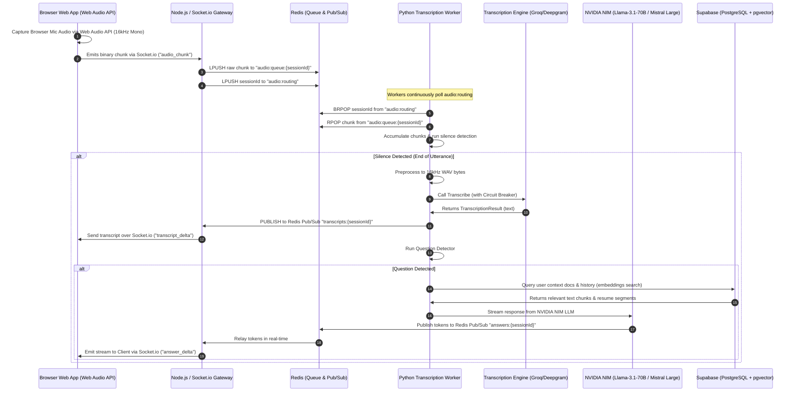

# Technical Architecture & System Design Study Guide
## Project: AI Interview Coach & Live Prep Assistant

This document provides a comprehensive, principal-architect-level technical breakdown of the **AI Interview Coach & Live Prep Assistant** platform. It details the system design, tech stack rationales, core engineering challenges, database schemas, and future scaling roadmaps. It is designed to prepare you for technical interviews, allowing you to explain the end-to-end frontend-to-backend flow and defend your engineering decisions.

---

## 1. System Overview & Architecture

The platform is a browser-native, real-time interview preparation and coaching system consisting of two primary components:
1. **Live Browser Assistant (Real-time Mode)**: A browser-native streaming interface that captures microphone audio in real-time, streams it to a Node.js API Gateway via WebSockets, and routes it to a Python-based background worker pool to transcribe, detect questions, and stream conceptual guidance, definitions, and technical tips back to the user's dashboard in real-time.
2. **AI Interview Coach (Practice Mode)**: An interactive mock interview simulator in the Next.js web application. It conducts structured multi-turn interviews (behavioral, technical, or rapid-fire) using an agentic state machine (built on LangGraph). The coach dynamically selects practice questions targeting the user's logged weaknesses and provides multi-metric evaluations (STAR method structure, clarity, technical accuracy, confidence, and filler word analysis).

### End-to-End Real-time Audio Data Flow (Mermaid Diagram)



---

## 2. Decoupled Architecture Services

```
  ┌────────────────────────────────────────────────────────────────────────────────────────┐
  │                                     NEXT.JS WEB APP                                    │
  │  ┌───────────────────────┐   ┌──────────────────────┐   ┌───────────────────────────┐  │
  │  │   Frontend Dashboard  │   │  API Route Proxies   │   │  Supabase Client SDK      │  │
  │  │   (Next.js 14 App)    │   │  (/api/coach/*)      │   │  (Auth, Sessions, Profile)│  │
  │  └──────────┬────────────┘   └──────────┬───────────┘   └─────────────┬─────────────┘  │
  └─────────────┼───────────────────────────┼─────────────────────────────┼────────────────┘
                │ (WebSockets)              │ (HTTP)                      │ (PostgreSQL/REST)
                ▼                           ▼                             ▼
┌────────────────────────┐      ┌───────────────────────┐   ┌──────────────────────────────┐
│  Node.js API Gateway   │◄────►│  Redis Cache/Broker   │◄─►│   FastAPI Python Service     │
│  (Express + Socket.io) │      │  (PubSub & Queues)    │   │   (LangGraph + Workers)      │
└────────────────────────┘      └───────────────────────┘   └─────────────┬────────────────┘
                                                                          │
                                                                          ▼
                                                            ┌──────────────────────────────┐
                                                            │     Third-Party LLM & AI     │
                                                            │  - NVIDIA NIM (LLMs)         │
                                                            │  - Mem0 (Personal Memory)    │
                                                            │  - Deepgram & Groq (STT)     │
                                                            └──────────────────────────────┘
```

---

## 3. Tech Stack & Architectural Rationale

As a Technical Lead, every technology in this stack was selected to solve a specific engineering bottleneck:

| Technology | Role | Why This Over Alternatives? |
| :--- | :--- | :--- |
| **Web Audio API** | Browser Audio Capture | Captures microphone audio directly through the user's browser via secure, standard HTML5 Web Audio MediaStreams. It handles resampling to 16kHz mono directly on the client side, bypassing the need for heavy desktop apps or server-side transcoding. |
| **Next.js 14 (App Router)** | Dashboard UI & App Server | Combines Server-Side Rendering (SSR) for fast dashboard loads, secure API route handlers acting as middle-tier gateways, and strict layout optimization. |
| **Node.js + Socket.io** | Real-time Streaming WebSocket Gateway | Node.js features an event-driven, non-blocking I/O loop that is exceptionally efficient at managing thousands of simultaneous open socket connections. Writing the WebSocket gateway in Node prevents blocking backend execution threads with streaming binary network traffic. |
| **Redis** | Message Broker & Cache Store | Serves as the high-throughput, low-latency mediator between the Node.js API Gateway and the Python workers. It handles intermediate binary audio chunk queues (lists), worker routing triggers, and broadcasts transcription/answers to Node.js via Redis Pub/Sub, separating real-time connections from AI processing. |
| **FastAPI (Python)** | Transcription & Agent Service | Python is the industry standard for ML/AI libraries (NVIDIA NIM APIs, LangGraph, NumPy, etc.). FastAPI provides an asynchronous, high-performance gateway using Uvicorn/Starlette that supports async request handling and webhooks. |
| **Supabase (PostgreSQL + pgvector)** | Relational DB & Vector Store | Combines a robust relational database (for profiles, history, and transactions) with a vector search engine (pgvector) to perform semantic retrieval. Using a single managed service reduces database connection overhead and simplifies transactional consistency. |
| **LangGraph (LangChain)** | Coach State Machine | Enables developer-defined, cycle-tolerant state machines. Standard LLM chains are linear and fail to gracefully model a back-and-forth interview flow (e.g. asking a question, waiting for response, evaluating, asking a follow-up, and looping). LangGraph maintains state variables explicitly and handles complex routing branches. |
| **NVIDIA NIM (LLM & Embeddings)** | LLM Inference Platform | Provides microservices delivering high throughput and low-latency inference for open models (Llama-3.1-70B-Instruct, Mistral Large, and Llama Nemotron Embeddings), which are vital for real-time applications. |
| **Mem0** | Long-Term Memory Database | Provides a semantic memory layer that dynamically extracts facts, preferences, and patterns about user behavior (e.g., "User struggles with STAR structure in behavioral questions"). This allows the system to build an adaptive profile that persists across different mock interview sessions. |
| **Groq Whisper & Deepgram Nova-2** | Speech-to-Text Engines | Groq Whisper-1 provides near-instantaneous transcription latencies. Deepgram Nova-2 serves as an ultra-stable backup to protect against Groq rate limits or outage spikes. |

---

## 4. Deep-Dive: Core Engineering Challenges & Solutions

### A. Browser-Based Real-time Audio Streaming, Chunking & Preprocessing
* **The Challenge**: Capture and stream raw audio data continuously from the user's microphone in the web browser, streaming it to a Node.js gateway and processing it in Python without introducing latency, thread blocks, or memory leaks.
* **The Solution**: 
  1. In [useAudioCapture.ts](file:///d:/Aiinterview/src/hooks/useAudioCapture.ts), we construct an HTML5 `AudioContext` resampled on the fly to `16000Hz` mono.
  2. We request microphone access via `navigator.mediaDevices.getUserMedia` and route the stream through a `ScriptProcessorNode` (configured for a buffer size of 4096).
  3. Every `250ms` (exactly `4000` samples at 16kHz), we pack the raw `Float32Array` values into an `ArrayBuffer` and emit it over Socket.io to the Node.js API Gateway.
  4. In [transcription_worker.py](file:///d:/Aiinterview/backend/services/transcription/app/workers/transcription_worker.py), the worker accumulates these chunks in Redis. 
  5. It runs silence detection by converting the buffer to a NumPy array and examining root-mean-square (RMS) energy.
  6. Silent chunks are skipped, preventing wasted transcription costs.
  7. When voice activity stops, the worker flushes the accumulated buffer, converts the Float32 samples to 16-bit PCM (Int16) format, wraps them in a standard RIFF/WAV header, and ships the WAV bytes to the transcription API.

```python
# Extract from AudioPreprocessor (backend/services/transcription/app/audio/preprocessor.py)
# Convert Float32 raw buffer to 16-bit PCM WAV bytes
import struct
import io

class AudioPreprocessor:
    @staticmethod
    async def preprocess(raw_float32_bytes: bytes) -> bytes:
        import numpy as np
        samples = np.frombuffer(raw_float32_bytes, dtype=np.float32)
        # Normalize and convert float32 to int16 range
        samples = np.clip(samples, -1.0, 1.0)
        int16_samples = (samples * 32767).astype(np.int16)
        
        # Write wav header
        out = io.BytesIO()
        out.write(b'RIFF')
        out.write(struct.pack('<I', 36 + len(int16_samples) * 2))
        out.write(b'WAVEfmt ')
        out.write(struct.pack('<IHHIIHH', 16, 1, 1, 16000, 32000, 2, 16))
        out.write(b'data')
        out.write(struct.pack('<I', len(int16_samples) * 2))
        out.write(int16_samples.tobytes())
        return out.getvalue()
```

### B. High-Availability STT: The Circuit Breaker Pattern
* **The Challenge**: Speech-to-Text APIs are prone to rate-limits and momentary timeouts. A timeout of 5 seconds during a live practice session ruins the real-time feedback experience.
* **The Solution**: 
  1. We implemented a hybrid fall-back pipeline with an active **Circuit Breaker** inside [engine.py (Transcription)](file:///d:/Aiinterview/backend/services/transcription/app/transcription/engine.py).
  2. Groq Whisper is our primary engine due to its exceptional speed. Deepgram Nova-2 is our fallback engine.
  3. The `CircuitBreaker` class tracks consecutive errors (timeouts, 502/503 errors).
  4. If failure thresholds are exceeded, the circuit opens. Subsequent calls immediately bypass Groq and route directly to Deepgram, saving valuable round-trip timeout latencies.
  5. After `reset_seconds` passes, the circuit enters a *half-open* state, testing Groq with a single request. If it succeeds, the circuit closes; if it fails, it opens again.

```python
# The Circuit Breaker class (backend/services/transcription/app/transcription/circuit_breaker.py)
class CircuitBreaker:
    def __init__(self, failure_threshold: int = 3, reset_seconds: int = 60):
        self.failure_threshold = failure_threshold
        self.reset_seconds = reset_seconds
        self.state = "CLOSED" # CLOSED, OPEN, HALF_OPEN
        self.failures = 0
        self.last_failure_time = 0

    async def should_use_fallback(self) -> bool:
        if self.state == "OPEN":
            if time.time() - self.last_failure_time > self.reset_seconds:
                self.state = "HALF_OPEN"
                return False
            return True
        return False

    async def record_failure(self):
        self.failures += 1
        self.last_failure_time = time.time()
        if self.failures >= self.failure_threshold:
            self.state = "OPEN"

    async def record_success(self):
        self.failures = 0
        self.state = "CLOSED"
```

### C. Agentic Practice Flows (LangGraph State Machine)
* **The Challenge**: A standard chatbot just answers questions. An interview coach must behave like an agent: ask a question, pause and wait for the answer, evaluate the answer across multiple dimensions, save user weaknesses, provide feedback, and formulate a dynamic follow-up or move to the next question based on user response depth.
* **The Solution**: We defined a LangGraph `StateGraph` in [coach_agent.py](file:///d:/Aiinterview/backend/services/transcription/app/agent/coach_agent.py).

```
                  ┌────────────────────────────────────────┐
                  │              router_entry              │
                  └───────────────────┬────────────────────┘
                                      │
                       Route from Entry (Conditional)
                                      │
              ┌───────────────────────┴───────────────────────┐
              ▼                                               ▼
   ┌────────────────────┐                          ┌────────────────────┐
   │ generate_question  │◄─────────────────────────┤  evaluate_answer   │
   └──────────┬─────────┘                          └──────────┬─────────┘
              │                                               │
             END                                     ┌────────▼─────────┐
      (Wait for response)                            │generate_feedback │
                                                     └────────┬─────────┘
                                                              │
                                                   Should Continue (Conditional)
                                                              │
                                             ┌────────────────┴────────────────┐
                                             ▼                                 ▼
                                   ┌────────────────────┐            ┌────────────────────┐
                                   │ generate_question  │            │    end_session     │
                                   └────────────────────┘            └─────────┬──────────┘
                                                                               │
                                                                              END
```

* **State Persistence**: The state graph is asynchronous and interruptible. When a question is generated, the agent returns the question and goes into `END` (suspending the graph execution). The state is saved in the transactional DB (Supabase `coach_sessions`/`coach_answers`).
* **Resuming execution**: When the user submits their answer, the `CoachAgentRunner` pulls the session history, reconstitutes the state, updates the variables with the user's input, and runs `ainvoke()`, resuming execution directly from `evaluate_answer`.

### D. Semantic Context Retrieval (Supabase PGVector & Redis)
* **The Challenge**: LLMs need context about the job description, the user's resume, and reference documents, but feeding huge documents on every audio chunk wastes tokens and blows past context windows.
* **The Solution**:
  1. We implement a custom document processor with a webhook listener inside [processor.py](file:///d:/Aiinterview/backend/services/transcription/app/docs/processor.py).
  2. When a document/resume is uploaded to Supabase storage, a webhook fires. We extract text and generate structural summaries.
  3. We implement a double-tier caching layer in [cache_manager.py](file:///d:/Aiinterview/backend/services/transcription/app/docs/cache_manager.py). 
  4. The user's active resume and document text chunks are consolidated and cached in Redis with a 2-hour TTL (`docs:context:{userId}` and `resume:text:{userId}`).
  5. The `AnswerEngine` context builder merges this cached document context with the session's active history to construct a highly personalized prompt template.

---

## 5. Database Schema Architecture

The database is built on PostgreSQL with the `pgvector` extension enabled to support semantic similarity searches.

### A. Table Entity-Relationship Diagram (ERD)

```
┌──────────────────────────────────┐        ┌──────────────────────────────────┐
│             profiles             │        │            questions             │
├──────────────────────────────────┤        ├──────────────────────────────────┤
│ id (UUID, PK)                    │        │ id (UUID, PK)                    │
│ name (text)                      │        │ text (text)                      │
│ email (text)                     │        │ category (text)                  │
│ ...                              │        │ difficulty (text)                │
│                                  │        │ role_tags (text[])               │
└────────────────┬─────────────────┘        │ embedding (vector(2048))         │
                 │                          │ follow_up_questions (text[])     │
        ┌────────┴────────┐                 │ ideal_answer_points (text[])     │
        │ 1               │ 1               │ created_at (timestamptz)         │
        ▼                 ▼                 └────────────────┬─────────────────┘
┌───────────────┐ ┌────────────────────────┐                 │ 0..N
│    credits    │ │     coach_sessions     │                 │
├───────────────┤ ├────────────────────────┤                 │
│ id (PK)       │ │ id (UUID, PK)          │                 │
│ user_id (FK)  │ │ user_id (UUID, FK) ────┼────────┐        │
│ balance       │ │ role (text)            │        │        │
│ ...           │ │ session_type (text)    │        │        │
└───────────────┘ │ status (text)          │        │        │
                  │ questions_asked (int)  │        │        │
                  │ overall_score (decimal)│        │        │
                  │ strengths (text[])     │        │        │
                  │ weaknesses (text[])    │        │        │
                  │ report (jsonb)         │        │        │
                  └───────────┬────────────┘        │        │
                              │ 1                   │        │
                              │                     │        │
                              ▼ 0..N                ▼ 1      ▼ 1
                        ┌────────────────────────────────────────┐
                        │             coach_answers              │
                        ├────────────────────────────────────────┤
                        │ id (UUID, PK)                          │
                        │ session_id (UUID, FK) ─────────────────┘
                        │ user_id (UUID, FK)                     │
                        │ question_id (UUID, FK, Nullable) ──────┘
                        │ question_text (text)                   │
                        │ answer_text (text)                     │
                        │ star_score (decimal)                   │
                        │ clarity_score (decimal)                │
                        │ technical_score (decimal)              │
                        │ confidence_score (decimal)             │
                        │ overall_score (decimal)                │
                        │ filler_word_count (int)                │
                        │ strengths_in_answer (text[])           │
                        │ improvements (text[])                  │
                        │ feedback_text (text)                   │
                        │ follow_up_asked (text)                 │
                        │ embedding (vector(2048))               │
                        └────────────────────────────────────────┘
```

### B. Weakness Tracking & Adaptive Learning (`user_weaknesses`)
To target practice questions at what a user is worst at, the system maintains a `user_weaknesses` table:
* Columns: `id` (PK), `user_id` (FK), `category` (text), `weakness_description` (text), `occurrence_count` (int), `last_seen_at` (timestamptz), `resolved` (bool).
* On every answer evaluation, if the LLM notes a weakness, the backend updates this table. If a weakness is repeated, it increments `occurrence_count`.
* During mock session initialization, the system fetches the user's top unresolved weaknesses, generates an embedding, and calls a Supabase RPC function (`match_questions`) to fetch matching questions from the `questions` bank.

```sql
-- pgvector cosine similarity function used by our RPC (match_questions)
CREATE OR REPLACE FUNCTION public.match_questions(
  query_embedding vector(2048),
  match_count integer,
  filter_category text DEFAULT NULL
)
RETURNS TABLE (
  id uuid, text text, category text, difficulty text, role_tags text[], similarity double precision
)
LANGUAGE plpgsql AS $$
BEGIN
  RETURN QUERY
  SELECT
    q.id, q.text, q.category, q.difficulty, q.role_tags,
    (1 - (q.embedding <=> query_embedding))::double precision AS similarity
  FROM public.questions q
  WHERE (filter_category IS NULL OR q.category = filter_category)
  ORDER BY q.embedding <=> query_embedding
  LIMIT match_count;
END;
$$;
```

---

## 6. Principal Architect Interview Q&A (Prepare to Defend!)

### Q1: "Why did you use Node.js AND Python? Why not write the entire backend in Python?"
> **Answer**: This is a classic separation of concerns for real-time systems. Node.js is optimized for high-concurrency, low-CPU operations like managing WebSockets, maintaining connection states, and handling rapid, small I/O actions. It operates on a single-threaded event loop, which handles networking efficiently. Python, on the other hand, is great for heavy CPU/AI workloads but suffers from the Global Interpreter Lock (GIL) and is less efficient at raw WebSocket scaling. By decoupling them with Redis as a broker, the Node.js API Gateway is insulated from blocking AI functions, and the Python workers can be scaled horizontally and independently depending on GPU/CPU processing loads.

### Q2: "Since your Python workers are processing audio chunks from Redis asynchronously, how do you prevent race conditions when two chunks from the same session arrive simultaneously?"
> **Answer**: We use a queue-routing model. The Node.js gateway pushes chunks to a session-specific queue (`audio:queue:{sessionId}`) and publishes the `sessionId` to a global routing list (`audio:routing`). The Python workers block on the routing list using `BRPOP`. Because `BRPOP` is an atomic Redis operation, only *one* worker is assigned to process a session ID at a time. The worker pops the session ID, pulls all pending chunks from that session's queue, consolidates them, and processes them sequentially. This guarantees that chunks are never processed out of order or by different workers simultaneously.

### Q3: "What are the drawbacks of using pgvector for question retrieval, and how would you scale it to millions of questions?"
> **Answer**: `pgvector` does exact nearest-neighbor search by default, which performs a sequential scan (`O(N)` complexity) over the database. This works fine for thousands of questions, but for millions, it causes query latency spikes. 
> To scale it, we would apply an Approximate Nearest Neighbor (ANN) index like **HNSW (Hierarchical Navigable Small World)** or **IVFFlat**. HNSW builds a multi-layered graph of vectors, changing lookup times to `O(log N)` complexity. Additionally, we would partition our questions by `role_tags` and `category` using standard PostgreSQL table partitioning, narrowing vector scans to sub-indices.

### Q4: "Your speech-to-text Circuit Breaker uses an in-memory state. What happens if your FastAPI instance crashes or restarts? Doesn't the state reset?"
> **Answer**: Yes, currently the circuit breaker state is stored in-memory in the FastAPI container. If the container restarts, it resets to `CLOSED`. In a production-grade multi-instance deployment (e.g., Kubernetes), this would cause a "thundering herd" issue where all fresh pods try to hit the degraded Groq API again. 
> To solve this, we would move the circuit breaker state to Redis. By saving variables like `failures` and `state` as shared keys (e.g. `circuit_breaker:groq:state`), all running FastAPI instances can query the circuit state in `<1ms` and act as a unified cluster.

### Q5: "Why did you use LangGraph for Practice Mode, and what are its trade-offs?"
> **Answer**: Standard LLM chains (like `LLMChain`) are stateless and linear. An interview coach must behave like a state machine with cyclic loops (ask -> evaluate -> follow up -> evaluate -> ask new). With LangGraph, we can model the interview explicitly as nodes and conditional edges. The trade-offs are:
> 1. **Higher Latency**: Running through multiple nodes (evaluation, feedback, question generation) sequentially takes more LLM API calls and time. We optimized this by evaluating in the background and returning the next question quickly.
> 2. **State Management Overhead**: Maintaining a complex dictionary state (`CoachState`) requires strict data formatting. Any API formatting change in the LLM output can break downstream graph nodes. We solved this with rigorous Pydantic input/output parsing.

---

## 7. Production Roadmap: Scaling the Platform

If you were given a budget and team to take this project to enterprise-scale, here is the roadmap:

1. **Migrate WebSockets to WebRTC (MediaSoup / WebRTC Gateway)**:
   Instead of streaming audio over WebSockets (which uses TCP and suffers from head-of-line blocking), use WebRTC (UDP-based). We can route audio streams to a Media Server (like MediaSoup or LiveKit) which handles noise gating and sends unified audio directly to transcription workers via RTP.
2. **Implement HNSW pgvector Indexing**:
   Activate HNSW index on the `questions` table embedding column with `vector_cosine_ops` parameters to support sub-millisecond retrieval times.
3. **Decouple Worker Orchestration with Celery & Flower**:
   Replace the custom Redis polling loop with Celery task queues. This provides built-in worker heartbeat detection, auto-scaling of worker pods based on queue length, and robust task monitoring via Flower dashboards.
4. **Deploy LLM-as-a-Judge Calibration**:
   LLM evaluations (e.g., score out of 10) are subjective and prone to drift. Introduce a calibration pipeline that feeds anonymized answers to multiple model instances, averages scores, and runs periodic evaluation sanity checks against human-graded benchmarks.
